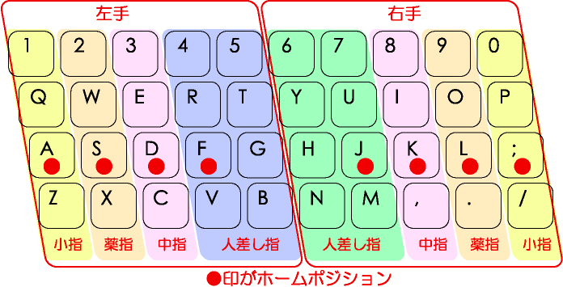

# 第1回　Pythonの復習

### 座席の指定

秋学期は半指定席制とする．
各自好きな座席に着席して良いが，秋学期中は**本日着席した座席から移動しないこと**．
他の席に変更したい場合には担当教員まで相談してから移動すること．
（必修科目では出席を厳密に把握しておく必要があるため）

### 到達目標

- Jupyter Notebookを起動し，Notebookファイルを新規作成できる．
- CodeセルとMarkdownセルを使い分けられる．
- コンパイラ方式とインタプリタ方式の違いを説明できる．
- Pythonで文字列の表示と数値計算ができる．
- 変数へ値を代入し，値の型を確認できる．
- `len`関数を使い，文字列の文字数を調べられる．

### 必修内容

1. Pythonの基本：変数，加減乗除，条件分岐，繰り返し，関数を扱う．
2. ファイル操作と数値計算：テキスト・CSVファイルを扱い，整数，方程式，微分，積分，乱数を題材とするプログラムを作成する．
3. 可視化：Matplotlibを用いて計算結果をグラフで表す．
4. UNIX系OS：エディタとターミナルを用いてPythonプログラムを作成・実行する．
5. 生成AI：生成AIを活用してPythonによるゲームプログラムを作成する．

### スケジュール

1. Pythonの概要，環境整備，変数と計算
2. 制御構文1：条件分岐
3. 制御構文2：繰り返し
4. 関数
5. ファイル操作
6. 整数を扱う計算
7. 数値計算1
8. 数値計算2
9. 数値計算3
10. 可視化
11. 可視化，UNIX系OSの使い方
12. 生成AIとPythonでゲームを作ろう1
13. 生成AIとPythonでゲームを作ろう2，まとめ

### 成績評価

- <span style="color:red">平常点40点・課題点60点の計100点</span>で成績を評価する．
- <span style="color:red">欠席を1回するごとに平常点から10点減点</span>する．
体調不良・法事・部活動の大会などのやむを得ない事情により講義を欠席する場合には事務に連絡すること．
連絡のあった回については平常点の減点を行わない．
- なお，欠席回の課題は課題点に加算されるため，後日提出すること．
- 本学の規程（[学則・学位規程・ガバナンスコード｜城西大学](https://www.josai.ac.jp/about/information/gakusokukitei/)）に従い，<span style="color:red">5回以上欠席した場合には単位が与えられない（Z評価）</span>．
- 他の学生の講義の受講を阻害する行為を行なった学生は平常点から減点する．
- 全ての講義が終了した段階で<span style="color:red">平常点と課題点の総点が60点以上にならなかった場合には単位は与えられない（F評価）</span>．

```{dropdown} 欠席の手続き
1. 事務室で欠席届を受け取る．
2. 欠席届に必要事項を記入し，必要に応じて添付資料を用意する．
3. 欠席届と添付資料を事務に提出し，確認印を押してもらう．
4. 確認印を押された欠席届のコピーと添付資料のコピーを，欠席した講義の担当教員に提出する．
```

### 準備学習等の指示

- 各自のMacBookを持参すること．各回の課題では各自のMacBookを使用する．
- MacBookは充電をしておくこと．

### 出席登録

- <span style="color:red">毎回UNIPAで出席登録を行う</span>．
- 講義の始めにパスワードを掲示するため，これを入力することで出席登録を完了する．
- システムの仕様上，登録可能時間は講義開始時刻10分前〜35分後（10:50-11:35）であり，それ以降は欠席扱いとなる．

### タイピング（20分）

- 秋学期のタイピング練習は初回のみとする．
- 指はホームポジションに置く．ここから各指で所望のキーをタイプする．



出典：[https://upload.wikimedia.org/wikipedia/commons/6/67/TouchTyping_HomePosition_QWERTY.png](https://upload.wikimedia.org/wikipedia/commons/6/67/TouchTyping_HomePosition_QWERTY.png)

```{tip} 注意：タイピング練習
次のサイトなどでタイピング練習をすること（各自好きな方法で練習して良い）．

- 寿司打（スシダ）[https://sushida.net/](https://sushida.net/)
- e-typing [https://www.e-typing.ne.jp/](https://www.e-typing.ne.jp/)
```

## 情報セキュリティテスト（10分）

WebClassの「参加しているコース」→「その他のコース」内にある「情報セキュリティテスト」を選択し，テストを実施する．

## フレッシュマンセミナーIの復習

フレッシュマンセミナーIの第12・13回では，Jupyter Notebookを用いてPythonの基礎を学んだ．
Pythonで記述したソースコードを実行すると，コンピュータが処理を行い，結果またはエラーを出力する．

| 内容 | 確認すること |
| --- | --- |
| Notebook | CodeセルとMarkdownセルの役割 |
| 出力 | `print`関数による値の表示 |
| 計算 | 算術演算子と計算の順序 |
| 変数 | 値の代入と変数を用いた計算 |
| 型 | `int`，`float`，`complex`，`bool`，`str` |

## プログラムを実行する方式

プログラミング言語で書いたソースコードをコンピュータが実行するには，処理系による変換または解釈が必要である．代表的な実行方式を次に示す．

| 方式 | 処理の概要 | 代表的な言語・処理系 |
| --- | --- | --- |
| **コンパイラ方式** | ソースコードを実行前にまとめて別の形式へ変換する | C，C++，Fortranなど |
| **インタプリタ方式** | 実行時にソースコードや中間的な命令を解釈しながら処理する | Python，JavaScriptなどの代表的な処理系 |


- コンパイラ方式：翻訳した文書を用意してから相手へ渡すことに相当する．
- インタプリタ方式：話を聞きながら順に通訳することに相当する．

<!-- 
```{tip} 用語の使い分け
「コンパイラ言語」「スクリプト言語」のように言語そのものを二種類へ分けると，実際の処理方法を正確に表せない場合がある．一つの言語に複数の処理系が存在し，コンパイルと解釈を組み合わせる処理系もあるため，本講義では**コンパイラ方式**と**インタプリタ方式**という用語を使用する．
```
 -->

## Jupyter Notebookの準備

1. Anaconda NavigatorからJupyter Notebookを起動する．
2. `Documents（書類）`フォルダを開く．
3. `Fresh2`フォルダがなければ，`New`から`New Folder`を選択する．
4. 作成されたフォルダを選択し，`Rename`から名前を`Fresh2`へ変更する．
5. `Fresh2`フォルダを開く．すでに作成済みの場合は，そのフォルダを開く．
6. Python 3のNotebookを新規作成する．
7. ファイル名を`第1回_<学籍番号>_<氏名>.ipynb`へ変更する．

```{tip} 注意：保存場所
この講義で作成するファイルは，原則として`Documents（書類）/Fresh2`フォルダへ保存する．フォルダ名の大文字と小文字，数字の`2`まで正確に入力する．
```

Notebookでは，次の二種類のセルを使う．

| セル | 用途 |
| --- | --- |
| Codeセル | Pythonのコードを入力して実行する |
| Markdownセル | 見出し，説明文，箇条書きを記述する |

```{tip} 実行方法
セルを選択して`Shift`を押しながら`Enter`を押すと，セルを実行して次のセルへ移動できる．
```

## Pythonの基本（復習）

### 文字列の表示と数値計算

次のコードを1行ずつ別のCodeセルへ入力し，上から順に実行する．

```python
print("Hello, World!")

5 + 2
5 - 2
5 * 2
5 / 2
5 ** 2
5 // 2
5 % 2
```

主な算術演算子は次のとおりである．

| 演算 | 演算子 | 例 |
| --- | --- | --- |
| 加算・減算 | `+`・`-` | `5 + 2`・`5 - 2` |
| 乗算・除算 | `*`・`/` | `5 * 2`・`5 / 2` |
| べき乗 | `**` | `5 ** 2` |
| 切り捨て除算・剰余 | `//`・`%` | `5 // 2`・`5 % 2` |

丸括弧の内側，べき乗，乗除，加減の順に計算される．
計算順序を明示したい場合は丸括弧を使用する．

```python
2 + 3 * 4
(2 + 3) * 4
```

```{note} 演習1（復習）
作成した`第1回_<学籍番号>_<氏名>.ipynb`に，新しいCodeセルを追加して次の操作を行う．

1. `print`関数を使い，「Pythonの計算を復習します．」と表示する．
2. `8 + 4 * 3`と`(8 + 4) * 3`をそれぞれ計算し，結果を比べる．
3. 23を5で割ったときの商と余りを，`//`と`%`を使って求める．
4. 2の10乗を，べき乗の演算子を使って求める．
```

<!--
演習1の解答例

```python
print("Pythonの計算を復習します．")

print(8 + 4 * 3)
print((8 + 4) * 3)

print(23 // 5)
print(23 % 5)

print(2 ** 10)
```
-->

### 変数と型

記号 `=` は，右辺を評価して得られた値を左辺の変数へ代入する記号である．

※ 数学では `=` は両辺が等しいことを表す記号であるが，プログラミングでは右辺を左辺に代入することを意味し，両辺の関係は等価ではないことに注意する必要がある．

```python
score = 80
score = score + 5

print(score)
print(type(score))
```

`type`関数を使うと値の型を確認できる．
数値と文字列は異なる型であり，必要に応じて`int`，`float`，`str`などで型を変換する．

```python
name = "佐藤"
score = 85

print(f"{name}さんの得点は{score}点です．")
```

文字列を囲む引用符の直前に`f`または`F`を付けると，f-stringになる．f-stringでは，波括弧`{}`の中に書いた変数や式が実行時に評価され，その値が文字列へ埋め込まれる．上の例では，`{name}`が「佐藤」に，`{score}`が「85」に置き換わるため，「佐藤さんの得点は85点です．」と表示される．

- **f-string**：*formatted string literal*（フォーマット済み文字列リテラル）の略称
- 文字列リテラル：`"佐藤"`のようにプログラムへ直接書いた文字列

```{note} 演習2（復習）
同じNotebookに新しいCodeセルを追加して，次の操作を行う．

1. 学習する科目名を文字列として変数`subject`へ代入する．
2. 一週間の目標学習時間を整数として変数`study_time`へ代入する．
3. `type`関数を使い，`subject`と`study_time`に代入された値の型を確認する．
4. f-stringを使い，「今週は〇〇を△△時間学習します．」と表示する．〇〇と△△の部分には，変数`subject`と`study_time`の値を埋め込む．
```

<!--
演習2の解答例

```python
subject = "Python"
study_time = 3

print(type(subject))
print(type(study_time))

print(f"今週は{subject}を{study_time}時間学習します．")
```
-->

## エラーが出たとき

- エラーメッセージの最後の行を確認する．
- 直前に入力したコードのつづり，括弧，引用符を確認する．
- 全角記号が混ざっていないか確認する．
- 変数を代入したセルから順番に再実行する．

## 文字数を数える関数

文字列の文字数は，組み込み関数`len`を使って調べることができる．`len`の丸括弧の中に文字列または文字列を代入した変数を書く．

```python
message = "Pythonを復習します．"
mojisuu = len(message)

print(mojisuu)
```

この例では，`len(message)`が変数`message`に代入された文字列の文字数を返す．その結果を変数`mojisuu`へ代入し，`print`関数で表示している．

長い文章は，三つの二重引用符`"""`で囲むと複数行に分けて記述できる．

```python
kansou = """夏休みには，前期の学習内容を振り返りました．
後期には，計画的に学習を進めたいです．"""

print(len(kansou))
```

```{tip} 注意：数えられる文字
`len`は，ひらがな，漢字，英数字，句読点，空白などをそれぞれ一文字として数える．複数行の文字列では，改行も一文字として数えられる．
```

````{warning} 課題
Codeセルを追加し，次の手順に従って夏休みにしたことやその感想などを自由に記述し，その文字数をNotebookに表示せよ．

1. 変数`kansou`を用意する．
2. 夏休みの感想を文字列として`kansou`へ代入する．
3. `len`関数を使い，`kansou`の文字数を出力する．
4. `kansou`の文字数が**400文字以上**になるように感想を書く．

複数行の文章を書く場合は，次のコードを参考にする．

```python
kansou = """ここに夏休みの感想を書く．
ダブルクオテーション3つでくくると
このように改行できるようになる．"""

print(len(kansou))
```

完成したNotebookを保存し，WebClassから提出する．

**剽窃チェックについて**

教員は，提出されたレポート同士の文章一致率を確認できる剽窃チェックツールを使用する．他の学生の感想と80%以上一致する提出物が確認された場合は，一致する感想を提出した学生全員を減点対象とする．他の人には書けないような自分自身の経験を自分の言葉で記述すること．
````

### 提出方法

- WebClassの「第1回課題」からNotebookファイル（`第1回_<学籍番号>_<氏名>.ipynb`）を提出する．
- 提出前にファイル名・Codeセルの実行結果・Markdownセルの内容を確認する．
- すべてのCodeセルの出力を表示した状態で保存する．

## まとめ

- CodeセルにはPythonのコード，Markdownセルには説明を書く．
- `print`関数で値を表示し，算術演算子で計算する．
- 変数へ値を代入し，`type`関数で型を確認する．
- `len`関数で文字列の文字数を調べる．
- 次回は条件分岐を扱う．
