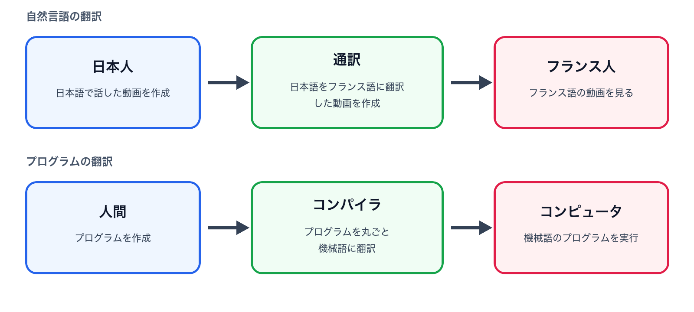

# 第1回　Pythonの復習

### 到達目標

- Jupyter Notebookを起動し，Notebookファイルを新規作成できる．
- CodeセルとMarkdownセルを使い分けられる．
- コンパイラ方式とインタプリタ方式の違いを説明できる．
- Pythonで文字列の表示と数値計算ができる．
- 変数へ値を代入し，値の型を確認できる．

### 必修内容

1. Pythonの基本：変数，加減乗除，条件分岐，繰り返し，関数を扱う．
2. ファイル操作と数値計算：テキスト・CSVファイルを扱い，整数，方程式，微分，積分，乱数を題材とするプログラムを作成する．
3. 可視化：Matplotlibを用いて計算結果をグラフで表す．
4. UNIX系OS：エディタとターミナルを用いてPythonプログラムを作成・実行する．
5. 生成AI：生成AIを活用してPythonによるゲームプログラムを作成する．

### スケジュール

1. Pythonの概要，環境整備，変数と計算
2. 制御構文1：条件分岐
3. 制御構文2：繰り返し
4. 関数
5. ファイル操作
6. 整数を扱う計算
7. 数値計算1
8. 数値計算2
9. 数値計算3
10. 可視化
11. 可視化，UNIX系OSの使い方
12. 生成AIとPythonでゲームを作ろう1
13. 生成AIとPythonでゲームを作ろう2，まとめ

### 成績評価

- <span style="color:red">平常点40点・課題点60点の計100点</span>で成績を評価する．
- <span style="color:red">欠席を1回するごとに平常点から10点減点</span>する．
体調不良・法事・部活動の大会などのやむを得ない事情により講義を欠席する場合には事務に連絡すること．
連絡のあった回については平常点の減点を行わない．
- なお，欠席回の課題は課題点に加算されるため，後日提出すること．
- 本学の規程（[学則・学位規程・ガバナンスコード｜城西大学](https://www.josai.ac.jp/about/information/gakusokukitei/)）に従い，<span style="color:red">5回以上欠席した場合には単位が与えられない（Z評価）</span>．
- 他の学生の講義の受講を阻害する行為を行なった学生は平常点から減点する．
- 全ての講義が終了した段階で<span style="color:red">平常点と課題点の総点が60点以上にならなかった場合には単位は与えられない（F評価）</span>．

```{dropdown} 欠席の手続き
1. 事務室で欠席届を受け取る．
2. 欠席届に必要事項を記入し，必要に応じて添付資料を用意する．
3. 欠席届と添付資料を事務に提出し，確認印を押してもらう．
4. 確認印を押された欠席届のコピーと添付資料のコピーを，欠席した講義の担当教員に提出する．
```

### 準備学習等の指示

- 各自のMacBookを持参すること．各回の課題では各自のMacBookを使用する．
- MacBookは充電をしておくこと．

### 出席登録

- <span style="color:red">毎回UNIPAで出席登録を行う</span>．
- 講義の始めにパスワードを掲示するため，これを入力することで出席登録を完了する．
- システムの仕様上，登録可能時間は講義開始時刻10分前〜35分後（10:50-11:35）であり，それ以降は欠席扱いとなる．

## 情報セキュリティテスト

WebClassの「参加しているコース」→「その他のコース」内にある「情報セキュリティテスト」を選択し，テストを実施する．

## フレッシュマンセミナーIの復習

フレッシュマンセミナーIの第12・13回では，Jupyter Notebookを用いてPythonの基礎を学んだ．
Pythonで記述したソースコードを実行すると，コンピュータが処理を行い，結果またはエラーを出力する．

| 内容 | 確認すること |
| --- | --- |
| Notebook | CodeセルとMarkdownセルの役割 |
| 出力 | `print`関数による値の表示 |
| 計算 | 算術演算子と計算の順序 |
| 変数 | 値の代入と変数を用いた計算 |
| 型 | `int`，`float`，`complex`，`bool`，`str` |

## プログラムを実行する方式

プログラミング言語で書いたソースコードをコンピュータが実行するには，処理系による変換または解釈が必要である．代表的な実行方式を次に示す．

| 方式 | 処理の概要 | 代表的な言語・処理系 |
| --- | --- | --- |
| **コンパイラ方式** | ソースコードを実行前にまとめて別の形式へ変換する | C，C++，Fortranなど |
| **インタプリタ方式** | 実行時にソースコードや中間的な命令を解釈しながら処理する | Python，JavaScriptなどの代表的な処理系 |



- コンパイラ方式：翻訳した文書を用意してから相手へ渡すことに相当する．
- インタプリタ方式：話を聞きながら順に通訳することに相当する．

<!-- 
```{tip} 用語の使い分け
「コンパイラ言語」「スクリプト言語」のように言語そのものを二種類へ分けると，実際の処理方法を正確に表せない場合がある．一つの言語に複数の処理系が存在し，コンパイルと解釈を組み合わせる処理系もあるため，本講義では**コンパイラ方式**と**インタプリタ方式**という用語を使用する．
```
 -->

## Jupyter Notebookの準備

1. Anaconda NavigatorからJupyter Notebookを起動する．
2. `Documents（書類）/Fresh2`フォルダを開く．フォルダがなければ新規作成する．
3. Python 3のNotebookを新規作成する．
4. ファイル名を`1_{学籍番号}_{氏名}.ipynb`へ変更する．

Notebookでは，次の二種類のセルを使う．

| セル | 用途 |
| --- | --- |
| Codeセル | Pythonのコードを入力して実行する |
| Markdownセル | 見出し，説明文，箇条書きを記述する |

```{tip} 実行方法
セルを選択して`Shift`を押しながら`Enter`を押すと，セルを実行して次のセルへ移動できる．
```

## Pythonの基本（復習）

### 文字列の表示と数値計算

次のコードを1行ずつ別のCodeセルへ入力し，上から順に実行する．

```python
print("Hello, World!")

5 + 2
5 - 2
5 * 2
5 / 2
5 ** 2
5 // 2
5 % 2
```

主な算術演算子は次のとおりである．

| 演算 | 演算子 | 例 |
| --- | --- | --- |
| 加算・減算 | `+`・`-` | `5 + 2`・`5 - 2` |
| 乗算・除算 | `*`・`/` | `5 * 2`・`5 / 2` |
| べき乗 | `**` | `5 ** 2` |
| 切り捨て除算・剰余 | `//`・`%` | `5 // 2`・`5 % 2` |

丸括弧の内側，べき乗，乗除，加減の順に計算される．
計算順序を明示したい場合は丸括弧を使用する．

```python
2 + 3 * 4
(2 + 3) * 4
```

### 変数と型

記号 `=` は，右辺を評価して得られた値を左辺の変数へ代入する記号である．

※ 数学では `=` は両辺が等しいことを表す記号であるが，プログラミングでは右辺を左辺に代入することを意味し，両辺の関係は等価ではないことに注意する必要がある．

```python
score = 80
score = score + 5

print(score)
print(type(score))
```

`type`関数を使うと値の型を確認できる．
数値と文字列は異なる型であり，必要に応じて`int`，`float`，`str`などで型を変換する．

```python
name = "佐藤"
score = 85

print(f"{name}さんの得点は{score}点です．")
```

冒頭に `f` を付けた文字列では，波括弧`{}`の中に変数や式を埋め込めることができる．

````{note} 演習（復習）
一つのNotebookで次の操作を行う．

1. Markdownセルに「第1回 Pythonの復習」，学籍番号，氏名を書く．
2. Codeセルで`print`関数を使い，「Pythonを復習します．」と表示する．
3. 変数`radius`へ`3`を代入する．
4. 円周率を`3.14`として円の面積を計算し，変数`area`へ代入する．
5. f-stringを使い，「半径3の円の面積は28.26です．」と表示する．
6. `type(radius)`と`type(area)`を実行し，型を確認する．

円の面積は次の式で計算する．

$$
\text{円の面積}=\text{円周率}\times\text{半径}^2
$$
````

## エラーが出たとき

- エラーメッセージの最後の行を確認する．
- 直前に入力したコードのつづり，括弧，引用符を確認する．
- 全角記号が混ざっていないか確認する．
- 変数を代入したセルから順番に再実行する．

## 文字数を数える関数

## まとめ

- CodeセルにはPythonのコード，Markdownセルには説明を書く．
- `print`関数で値を表示し，算術演算子で計算する．
- 変数へ値を代入し，`type`関数で型を確認する．
- 次回は条件分岐を扱う．
