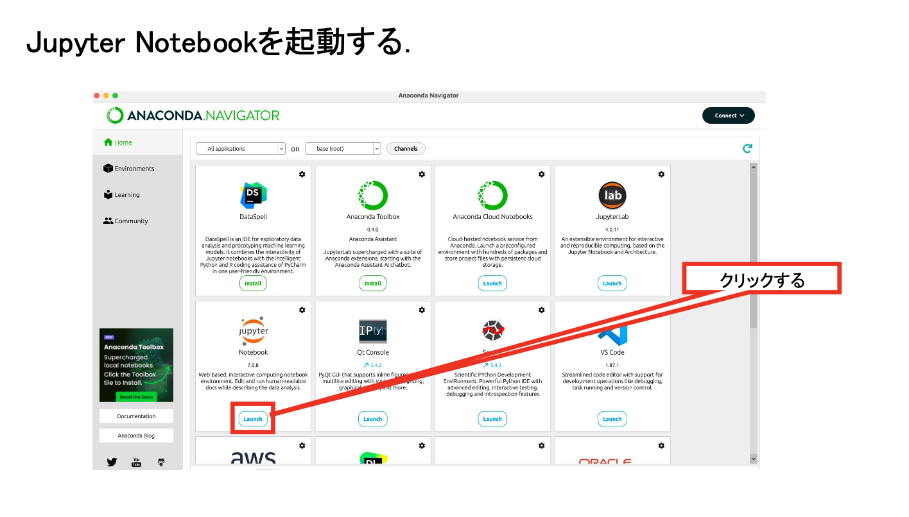
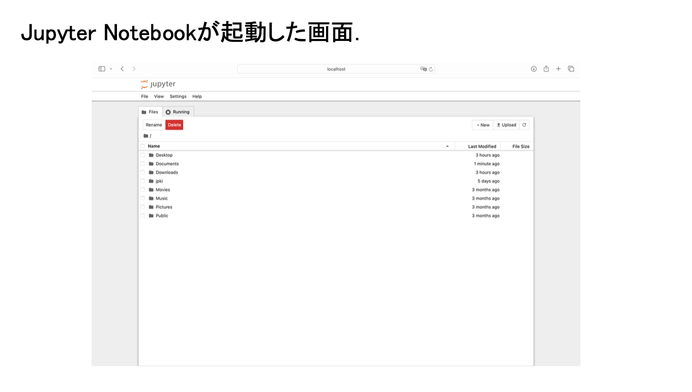
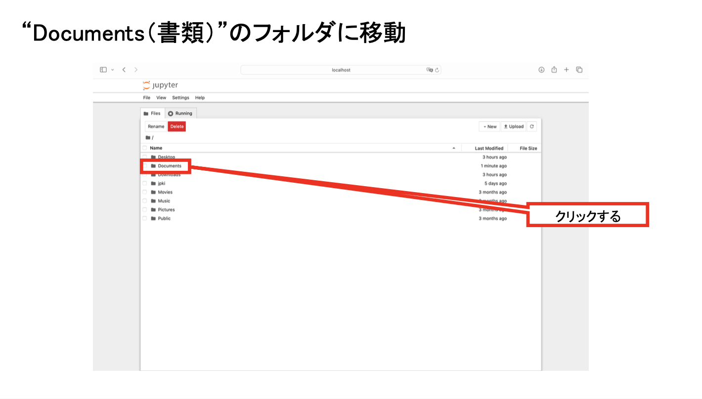
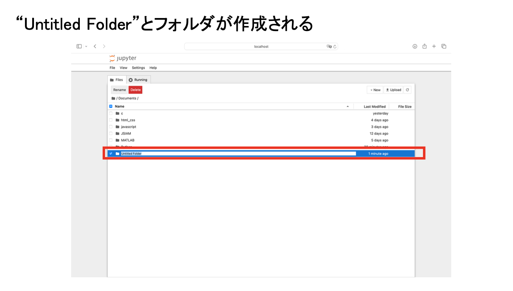
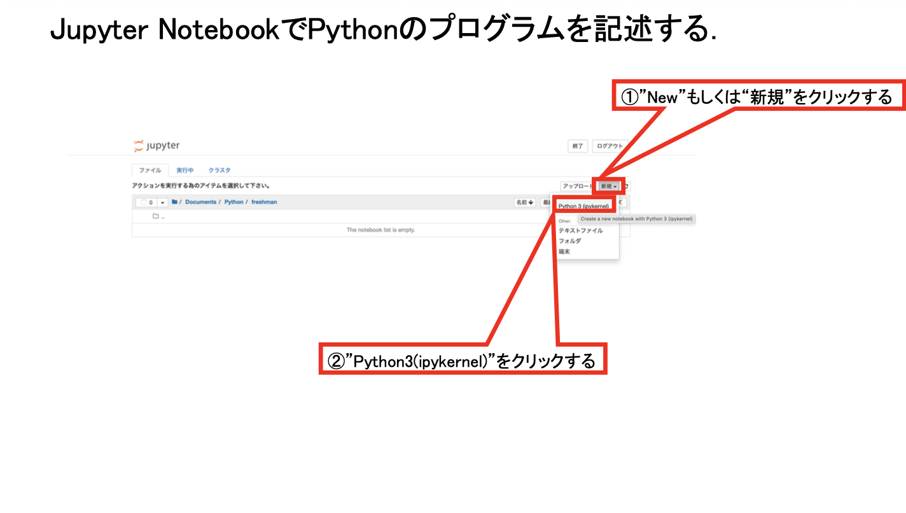
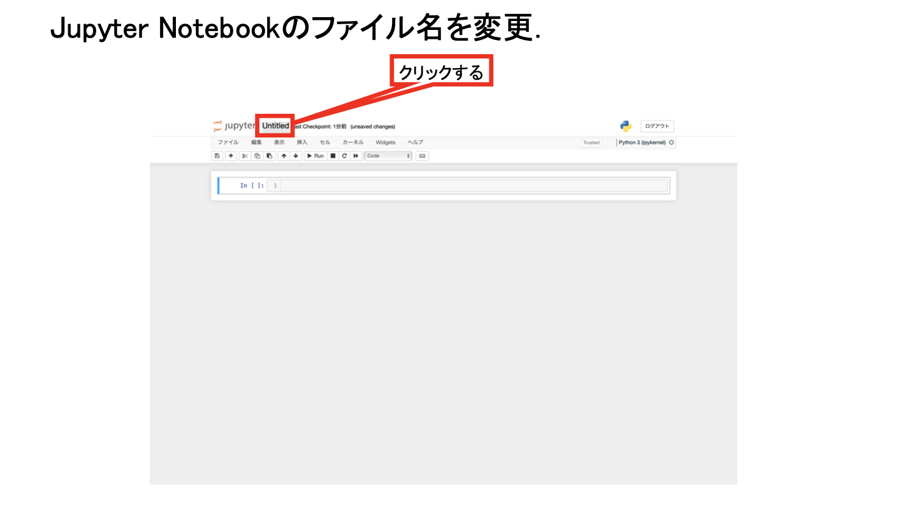
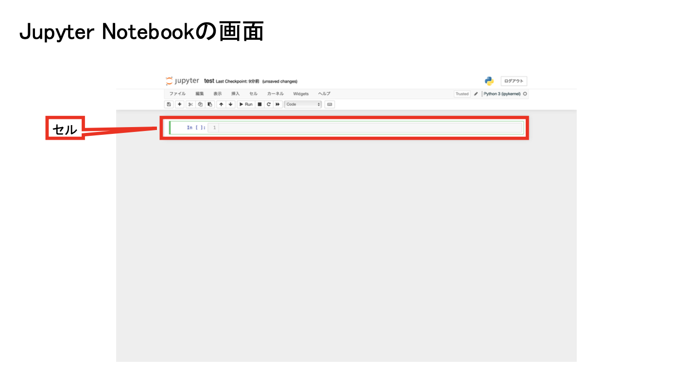

# 第2回　制御構文：条件分岐と繰り返し

### スケジュール変更

1. Pythonの概要，環境整備，変数と計算
2. 制御構文：条件分岐と繰り返し
3. 関数
4. ファイル操作
5. 整数を扱う計算
6. 数値計算1
7. 数値計算2
8. 数値計算3：Google Colabによる計算
9. 可視化
10. <span style="color:red">テスト</span>
11. UNIX系のOS，エディタの使い方
12. 生成AIとPythonでゲームを作ろうI
13. 生成AIとPythonでゲームを作ろうII

### 到達目標

- 条件分岐
  - 比較演算子を使って条件式を作成できる．
  - `if`・`elif`・`else`を使って処理を分岐できる．
  - 複数の条件を`and`・`or`・`not`で組み合わせられる．
- 繰り返し
  - `for`文を使って決まった回数の処理を繰り返せる．
  - `while`文を使って条件が成り立つ間，処理を繰り返せる．
  - `break`と`continue`を使って繰り返しを制御できる．

### 前回の復習

- Pythonの書き方を復習した．
- 変数へ値を代入した．
- 算術演算子を用いて計算した．

```python
score = 80
score = score + 5
print(score)
```

- **条件分岐**：変数の値に応じて実行する処理を変える．
- **繰り返し**：同じ処理を，回数や条件に応じて何度も実行する．

### Jupyter Notebookの準備

1. Anaconda NavigatorからJupyter Notebookを起動する．
2. `Documents（書類）/Fresh2`フォルダを開く．
3. Python 3のNotebookを新規作成する．
4. ファイル名を`第2回_<学籍番号>_<氏名>.ipynb`へ変更する．

```{dropdown} 忘れた人のためのJupyter Notebookの準備手順
### Jupyter Notebookを起動する

1. Spotlight検索（`command`+`Space`）でAnaconda Navigatorを起動する．
2. Anaconda Navigatorが表示されるまで待つ．
3. Jupyter Notebookの「Launch」をクリックする．
4. WebブラウザにJupyter Notebookのファイル一覧が表示されたことを確認する．






### Fresh2フォルダを開く

1. Jupyter Notebookのファイル一覧で`Documents（書類）`フォルダをクリックする．
2. `Fresh2`フォルダがある場合は，そのフォルダをクリックして開く．
3. `Fresh2`フォルダがない場合は，画面右上の「New」から「New Folder」を選択する．
4. 作成された`Untitled Folder`を選択し，「Rename」をクリックする．
5. フォルダ名を`Fresh2`へ変更し，そのフォルダを開く．





### Notebookファイルを新規作成する

1. `Fresh2`フォルダを開いた状態で，画面右上の「New」をクリックする．
2. 「Python 3 (ipykernel)」をクリックする．
3. 新しく開いたNotebook上部のファイル名をクリックする．
4. ファイル名を`第2回_<学籍番号>_<氏名>.ipynb`へ変更する．
5. `<学籍番号>`と`<氏名>`を自分の学籍番号と氏名へ置き換える．
6. Codeセルが表示されていることを確認する．







**注意：** Jupyter Notebookのバージョンによって，ボタンの名称や配置が画像と異なる場合がある．Notebookを作成したら，コードを入力する前に保存場所とファイル名を確認する．
```

## 条件式

比較演算子で二つの値を比較すると，結果は`True`または`False`になる．

| 比較 | 演算子 | 例 |
| --- | --- | --- |
| 等しい | `==` | `score == 80` |
| 等しくない | `!=` | `score != 80` |
| 大小 | `>`・`<` | `score >= 60` |
| 以上・以下 | `>=`・`<=` | `0 <= score` |

```python
score = 80

print(score >= 60)
print(score == 100)
```

## if文

`if`の条件が`True`のとき，**インデントされた処理を実行**する．

```python
score = 80

if score >= 60:
    print("合格です．")
else:
    print("不合格です．")
```

条件を三つ以上に分ける場合は`elif`（else ifの意味）を使う．

```python
score = 80

if score >= 90:
    grade = "A"
elif score >= 80:
    grade = "B"
elif score >= 70:
    grade = "C"
else:
    grade = "D"

print(grade)
```

複数の条件は**論理演算子**で組み合わせる．

```python
attendance = 12
score = 70

if attendance >= 10 and score >= 60:
    print("条件を満たしています．")
```

| 演算子 | 意味 |
| --- | --- |
| `and` | 両方の条件が`True` |
| `or` | 少なくとも一方が`True` |
| `not` | 真偽を反転する |

````{note} 演習1
変数`temperature`へ気温を代入し，次の条件でメッセージを表示するプログラムを作成せよ．

- 30以上：「暑いです．」
- 20以上30未満：「過ごしやすいです．」
- 20未満：「肌寒いです．」

`if`・`elif`・`else`をすべて使用せよ．
````

## for文

- `for`文：値を順番に取り出しながら処理を繰り返す．

```python
for number in range(1, 6):
    print(number)
```

`range(1, 6)`では，1から5までの整数が順に作られる．
合計値を求めるときは，計算結果を保存する変数を用意する．

```python
total = 0

for number in range(1, 11):
    total = total + number

print(total)
```

## while文

- `while`文：条件が`True`である間，処理を繰り返す．

```python
count = 3

while count > 0:
    print(count)
    count = count - 1

print("開始")
```

条件が常に`True`になると処理が終わらない．
繰り返しの中で条件に使う変数を更新する必要がある．

## breakとcontinue

- `break`：繰り返しを終了する．
- `continue`：残りの処理を飛ばして次の繰り返しへ進む．

```python
for number in range(1, 11):
    if number == 6:
        break
    if number % 2 == 0:
        continue
    print(number)
```

````{note} 演習2
1から30までの整数について，次の規則で表示するプログラムを作成せよ．

- 3の倍数：「Fizz」
- 5の倍数：「Buzz」
- 3と5の両方の倍数：「FizzBuzz」
- それ以外：整数をそのまま表示

`for`文と`if`文を組み合わせよ．
````

## エラーが出たときにチェックすること

- 条件の末尾にコロン`:`があるか確認する．
- `=`ではなく，比較には`==`を使っているか確認する．
- 分岐内のコードが半角4文字分インデントされているか確認する．
- 条件を上から順に判定して問題ない並びになっているか確認する．
- `range`の終点は含まれないことに注意する．
- `while`文が終了しない場合は，条件に使う変数が更新されているか確認する．

````{warning} 課題
`for`文と条件分岐を使い，0点から100点までの得点と評価を10点刻みで表示するプログラムを作成せよ．

1. 新しいMarkdownセルを追加し，「第2回課題」，学籍番号，氏名を記入せよ．
2. `range(0, 101, 10)`を使い，0から100までの得点を変数`score`へ順番に代入せよ．
3. `if`・`elif`・`else`を使い，得点を次の評価へ分類せよ．

   - 90点以上：S
   - 80点以上90点未満：A
   - 70点以上80点未満：B
   - 60点以上70点未満：C
   - 60点未満：D

4. f-stringを使い，各得点と評価を「0点：D」の形式で1行ずつ表示せよ．
5. 0点から100点までの11個の結果がすべて表示されていることを確認せよ．
6. 新しいMarkdownセルを追加し，条件を得点の高い順に並べる理由を2文以内で説明せよ．

`for`文，`if`文，`elif`，`else`をすべて使用せよ．
````

### 提出方法

- WebClassの「第2回課題」からNotebookファイル（`第2回_<学籍番号>_<氏名>.ipynb`）を提出する．
- 提出前にファイル名・Codeセルの実行結果・Markdownセルの内容を確認する．
- すべてのCodeセルの出力を表示した状態で保存する．

## まとめ

- 比較の結果は`True`または`False`になる．
- `if`・`elif`・`else`で条件に応じて処理を分ける．
- `for`文は回数や要素が決まった繰り返しに適している．
- `while`文は条件に基づく繰り返しに適している．
- 次回は処理をまとめて再利用する関数を扱う．
