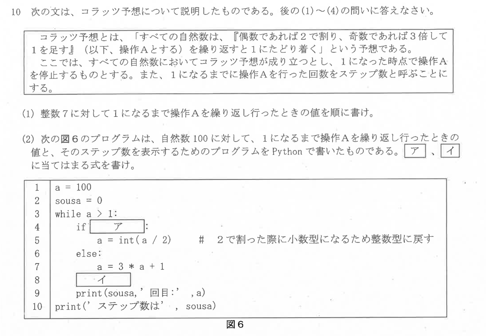
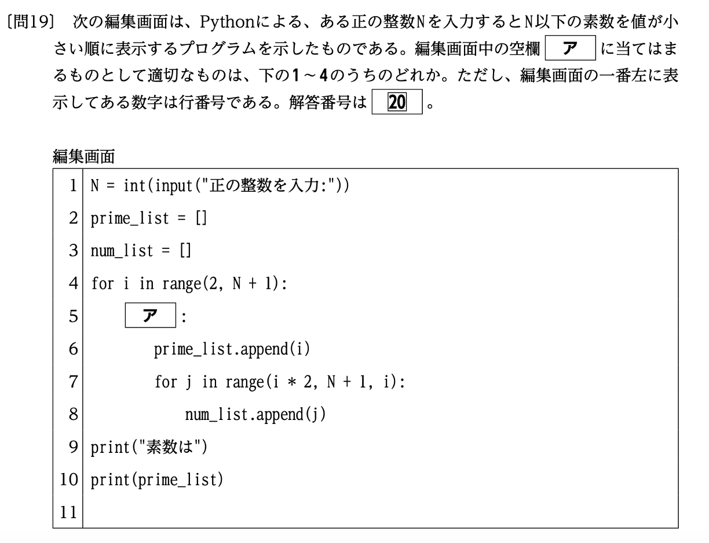
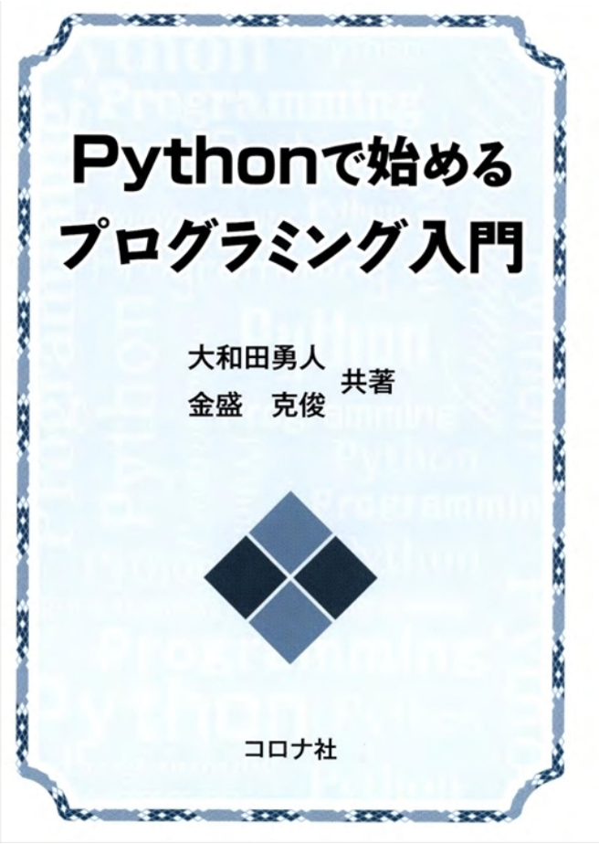
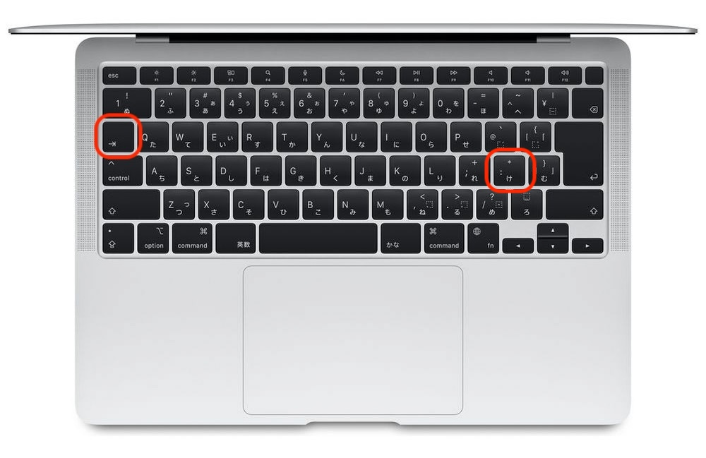

# 第2回　制御構文：条件分岐と繰り返し

### スケジュール変更

1. Pythonの概要，環境整備，変数と計算
2. 制御構文：条件分岐と繰り返し
3. 関数
4. ファイル操作
5. 整数を扱う計算
6. 数値計算1
7. 数値計算2
8. 数値計算3：Google Colabによる計算
9. 可視化
10. <span style="color:red">テスト</span>（用語の意味と具体例の説明，教員採用試験の類似問題）
11. UNIX系のOS，エディタの使い方
12. 生成AIとPythonでゲームを作ろうI
13. 生成AIとPythonでゲームを作ろうII

### 教員採用試験の問題例

令和6年度採用東京都公立学校教員第1次選考試験問題


令和8年度採用群馬県公立学校教員第1次選考試験問題



### 教科書

大和田勇人，金盛克俊「Pythonで始めるプログラミング入門」コロナ社，2015年．



### 到達目標

- 条件分岐
  - 比較演算子を使って条件式を作成できる．
  - `if`・`elif`・`else`を使って処理を分岐できる．
  - 複数の条件を`and`・`or`・`not`で組み合わせられる．
- 繰り返し
  - `for`文を使って決まった回数の処理を繰り返せる．
  - `while`文を使って条件が成り立つ間，処理を繰り返せる．
  - `break`と`continue`を使って繰り返しを制御できる．

### 前回の復習

- Pythonの書き方を復習した．
- 変数へ値を代入した．
- 算術演算子を用いて計算した．

```python
score = 80
score = score + 5
print(score)
```

- **条件分岐**：変数の値に応じて実行する処理を変える．
- **繰り返し**：同じ処理を，回数や条件に応じて何度も実行する．

### Jupyter Notebookの準備

1. Anaconda NavigatorからJupyter Notebookを起動する．
2. `Documents（書類）/Fresh2`フォルダを開く．
3. Python 3のNotebookを新規作成する．
4. ファイル名を`第2回_<学籍番号>_<氏名>.ipynb`へ変更する．

```{dropdown} 忘れた人のためのJupyter Notebookの準備手順
### Jupyter Notebookを起動する

1. Spotlight検索（`command`+`Space`）でAnaconda Navigatorを起動する．
2. Anaconda Navigatorが表示されるまで待つ．
3. Jupyter Notebookの「Launch」をクリックする．
4. WebブラウザにJupyter Notebookのファイル一覧が表示されたことを確認する．


### Fresh2フォルダを開く

1. Jupyter Notebookのファイル一覧で`Documents（書類）`フォルダをクリックする．
2. `Fresh2`フォルダがある場合は，そのフォルダをクリックして開く．
3. `Fresh2`フォルダがない場合は，画面右上の「New」から「New Folder」を選択する．
4. 作成された`Untitled Folder`を選択し，「Rename」をクリックする．
5. フォルダ名を`Fresh2`へ変更し，そのフォルダを開く．


### Notebookファイルを新規作成する

1. `Fresh2`フォルダを開いた状態で，画面右上の「New」をクリックする．
2. 「Python 3 (ipykernel)」をクリックする．
3. 新しく開いたNotebook上部のファイル名をクリックする．
4. ファイル名を`第2回_<学籍番号>_<氏名>.ipynb`へ変更する．
5. `<学籍番号>`と`<氏名>`を自分の学籍番号と氏名へ置き換える．
6. Codeセルが表示されていることを確認する．


**注意：** Jupyter Notebookのバージョンによって，ボタンの名称や配置が画像と異なる場合がある．Notebookを作成したら，コードを入力する前に保存場所とファイル名を確認する．
```

## 条件式

比較演算子で二つの値を比較すると，結果は`True`または`False`になる．

| 比較 | 演算子 | 例 |
| --- | --- | --- |
| 等しい | `==` | `score == 80` |
| 等しくない | `!=` | `score != 80` |
| 大小 | `>`・`<` | `score >= 60` |
| 以上・以下 | `>=`・`<=` | `0 <= score` |

```python
score = 80

print(score >= 60)
print(score == 100)
```

## インデントの役割

**インデント**とは，行の先頭を字下げすることである．Pythonでは，インデントを使って複数の文を一つの処理のまとまりにする．このまとまりを**ブロック**という．

次のひな型では，`処理1`と`処理2`が`if`文のブロックに含まれる．`処理3`はインデントされていないため，`if`文の外側にある．これは構成を説明するためのひな型であり，そのままでは実行できない．

```text
if 条件式:
    処理1
    処理2
処理3
```

同じブロックに含める行は，同じ幅でインデントする．本講義では，インデントを半角スペース4文字分に統一する．さらに内側へ処理を入れる場合は，もう一段インデントする．

次の画像で赤く囲まれた左側のキーが`Tab`キーである．Codeセルの行頭でこのキーを押すと，インデントを入力できる．



※ Mac book air 商品紹介画像

```{tip} 注意：スペースキーでインデントを手入力しない
スペースキーを何度か押して見た目だけを合わせる方法では，行ごとに字下げの幅がずれやすい．本講義では，Codeセルの行頭で`Tab`キーを押してインデントを入れること．Jupyter Notebookが適切な幅の字下げを挿入する．
```

```{tip} 注意：全角スペースは使用しない
日本語入力中に入力される全角スペースは，Pythonのインデントとして使用できない．全角スペースが混ざると，見た目では分かりにくいエラーの原因になる．また，タブ文字と半角スペースを同じファイル内で混在させないこと．
```

## if文

`if`の条件が`True`のとき，**インデントされた処理を実行**する．

`if`・`elif`・`else`を使うコードの一般的な構成は次のとおりである．上から順に条件式を調べ，最初に`True`となったブロックだけを実行する．どの条件にも当てはまらない場合は，`else`のブロックを実行する．

```text
if 条件式1:
    条件式1がTrueのときの処理
elif 条件式2:
    条件式1がFalseで，条件式2がTrueのときの処理
else:
    どの条件式もFalseのときの処理
```

条件が二つだけの場合は`elif`を省略し，`if`と`else`を使用する．`else`が不要な場合は，`if`のブロックだけでもよい．

```python
score = 80

if score >= 60:
    print("合格です．")
else:
    print("不合格です．")
```

条件を三つ以上に分ける場合は`elif`（else ifの意味）を使う．

```python
score = 80

if score >= 90:
    grade = "A"
elif score >= 80:
    grade = "B"
elif score >= 70:
    grade = "C"
else:
    grade = "D"

print(grade)
```

複数の条件は**論理演算子**で組み合わせる．

```python
attendance = 12
score = 70

if attendance >= 10 and score >= 60:
    print("条件を満たしています．")
```

| 演算子 | 意味 |
| --- | --- |
| `and` | 両方の条件が`True` |
| `or` | 少なくとも一方が`True` |
| `not` | 真偽を反転する |

````{note} 演習1
変数`temperature`へ気温を代入し，次の条件でメッセージを表示するプログラムを作成せよ．

- 30以上：「暑いです．」
- 20以上30未満：「過ごしやすいです．」
- 20未満：「肌寒いです．」

`if`・`elif`・`else`をすべて使用せよ．
````

<!--
````{dropdown} 解答例
```python
temperature = 25

if temperature >= 30:
    print("暑いです．")
elif temperature >= 20:
    print("過ごしやすいです．")
else:
    print("肌寒いです．")
```
````
-->

## for文

- `for`文：値を順番に取り出しながら処理を繰り返す．

`for`文の一般的な構成は次のとおりである．`繰り返す対象`から値を一つずつ取り出して`変数`へ代入し，インデントされた処理を値の個数だけ繰り返す．

```text
for 変数 in 繰り返す対象:
    取り出した値について繰り返す処理
```

連続する整数を使う場合は`range`関数を使用する．`開始値`から`終了値`の一つ手前までの整数が，順番に変数へ代入される．

```text
for 変数 in range(開始値, 終了値):
    各整数について繰り返す処理
```

```python
for number in range(1, 6):
    print(number)
```

`range(1, 6)`では，1から5までの整数が順に作られる．
合計値を求めるときは，計算結果を保存する変数を用意する．

```python
total = 0

for number in range(1, 11):
    total = total + number

print(total)
```

## while文

- `while`文：条件が`True`である間，処理を繰り返す．

`while`文の一般的な構成は次のとおりである．処理を一度実行するたびに条件式をもう一度調べ，条件式が`False`になると繰り返しを終了する．

```text
while 条件式:
    条件式がTrueである間，繰り返す処理
    条件式に使う変数を更新する処理
```

条件式に使う変数を更新しないと，条件式がいつまでも`True`のままとなり，繰り返しが終了しない場合がある．

```{tip} 注意：無限ループ
`while`文の条件式がいつまでも`True`のままだと，処理が終わらない**無限ループ**になる．繰り返しの中で，条件式に使う変数が終了条件へ近づくように更新されているか確認すること．

Jupyter Notebookで無限ループを実行した場合は，ツールバーの停止ボタン（■）を押すか，「Kernel」メニューから「Interrupt」を選択して実行を中断する．中断後は条件式と変数の更新処理を修正してから，セルを再実行する．
```

```python
count = 3

while count > 0:
    print(count)
    count = count - 1

print("開始")
```

条件が常に`True`になると処理が終わらない．
繰り返しの中で条件に使う変数を更新する必要がある．

## breakとcontinue

- `break`：繰り返しを終了する．
- `continue`：残りの処理を飛ばして次の繰り返しへ進む．

`break`と`continue`を含むコードの一般的な構成は次のとおりである．`終了条件`が成り立つと繰り返し全体を終了する．`スキップ条件`が成り立つと，その回の残りの処理だけを飛ばし，次の値の処理へ進む．

```text
for 変数 in 繰り返す対象:
    if 終了条件:
        break
    if スキップ条件:
        continue
    終了もスキップもしないときの処理
```

```python
for number in range(1, 11):
    if number == 6:
        break
    if number % 2 == 0:
        continue
    print(number)
```

## ガード節

- **ガード節**：処理を続けられない条件や特別に扱う条件を先に判定し，その後の処理から外す書き方．不適切な値を先に除外することで，正常な値に対する処理のインデントを深くせずに済む．

関数では`return`を使って処理を終了する方法が一般的である．ここではまだ関数を扱っていないため，`continue`を使って次の繰り返しへ進む例を示す．

```python
for score in range(-10, 111, 20):
    if not (0 <= score <= 100):
        print(f"{score}点は範囲外です．")
        continue

    print(f"{score}点を受け付けました．")
```

この例では，0点未満または100点より大きい値を見つけると，警告を表示して`continue`を実行する．その回の残りの処理は実行されず，次の値へ進む．したがって，最後の`print`関数は0点以上100点以下の場合だけ実行される．

````{note} 演習2
`for`文と条件分岐を使い，0点から100点までの得点と評価を10点刻みで表示するプログラムを作成せよ．

1. `range(0, 101, 10)`を使い，0から100までの得点を変数`score`へ順番に代入せよ．
2. `if`・`elif`・`else`を使い，得点を次の評価へ分類せよ．

   - 90点以上：S
   - 80点以上90点未満：A
   - 70点以上80点未満：B
   - 60点以上70点未満：C
   - 60点未満：D

3. f-stringを使い，各得点と評価を「0点：D」の形式で1行ずつ表示せよ．
4. 0点から100点までの11個の結果がすべて表示されることを確認せよ．

`for`文，`if`文，`elif`，`else`をすべて使用せよ．
````

<!--
````{dropdown} 解答例
```python
for score in range(0, 101, 10):
    if score >= 90:
        grade = "S"
    elif score >= 80:
        grade = "A"
    elif score >= 70:
        grade = "B"
    elif score >= 60:
        grade = "C"
    else:
        grade = "D"

    print(f"{score}点：{grade}")
```
````
-->

## エラーが出たときにチェックすること

- 条件の末尾にコロン`:`があるか確認する．
- `=`ではなく，比較には`==`を使っているか確認する．
- 分岐内のコードが半角4文字分インデントされているか確認する．
- 条件を上から順に判定して問題ない並びになっているか確認する．
- `range`の終点は含まれないことに注意する．
- `while`文が終了しない場合は，条件に使う変数が更新されているか確認する．

## 課題

````{warning} 課題1
西暦を変数`year`へ代入し，その年が「うるう年」か「平年」かを表示するプログラムを作成せよ．

1. 新しいMarkdownセルを追加し，「第2回課題」，学籍番号，氏名を記入せよ．
2. 新しいCodeセルを追加し，西暦を整数として変数`year`へ代入せよ．
3. 次の規則を条件式で表し，`if`・`elif`・`else`を使って判定せよ．

   - 400で割り切れる年は，うるう年である．
   - 400で割り切れず，100で割り切れる年は，平年である．
   - 100で割り切れず，4で割り切れる年は，うるう年である．
   - 以上のどれにも当てはまらない年は，平年である．

4. f-stringを使い，「2000年はうるう年です。」や「1900年は平年です。」の形式で表示せよ．
5. `year`を2000，1900，2024，2025へ変更してそれぞれ実行し，すべて正しく判定されることを確認せよ．（出力は残さなくて良い）
6. 最後に`year = 2025`として実行し，その出力を残せ．

割り算の余りは`%`で求められる．例えば，`year % 4 == 0`は「`year`が4で割り切れる」という条件を表す．
````

<!--
````{dropdown} 解答例
```python
year = 2025

if year % 400 == 0:
    result = "うるう年"
elif year % 100 == 0:
    result = "平年"
elif year % 4 == 0:
    result = "うるう年"
else:
    result = "平年"

print(f"{year}年は{result}です．")
```
````
-->

````{warning} 課題2
次のプログラムには，**インデント不足による文法誤り**と，修正後も残る**条件判定の誤り**がある．プログラムをコピーし，次の3段階をそれぞれ別のCodeセルで実行せよ．途中のセルと出力は削除しないこと．

このプログラムが意図する料金区分は次のとおりである．

- 65歳以上：シニア料金
- 6歳以上65歳未満：一般料金
- 6歳未満：幼児料金

```python
ages = [4, 10, 30, 70]

for age in ages:
    if age >= 6:
    category = "一般料金"
    elif age >= 65:
        category = "シニア料金"
    else:
        category = "幼児料金"

    print(f"{age}歳：{category}")
```

### 第1段階：エラーを確認する

1. 上のプログラムを新しいCodeセルへそのままコピーせよ．
2. プログラムを修正せずに実行せよ．
3. `IndentationError`が表示されることを確認し，エラーを表示したまま残せ．

### 第2段階：文法誤りを修正する

1. 第1段階のプログラムを別の新しいCodeセルへコピーせよ．
2. `category = "一般料金"`のインデントだけを修正せよ．条件式の順序は変更しないこと．
3. セルを実行し，エラーが出ないことを確認せよ．
4. 70歳が「一般料金」と表示され，意図した「シニア料金」にならないことを確認せよ．

### 第3段階：意図通りに動くように修正する

1. 第2段階のプログラムを別の新しいCodeセルへコピーせよ．
2. 65歳以上を先に判定するように，条件式とその処理の順序を修正せよ．
3. セルを実行し，4歳は「幼児料金」，10歳と30歳は「一般料金」，70歳は「シニア料金」と表示されることを確認せよ．
````

<!--
````{dropdown} 解答例
第1段階では，`if age >= 6:`の次の行にインデントがないため，`IndentationError`が発生する．

第2段階では，`category = "一般料金"`を`if`文のブロックへ入れる．文法誤りは解消するが，70は最初の`age >= 6`を満たすため，「一般料金」と表示される．

```python
ages = [4, 10, 30, 70]

for age in ages:
    if age >= 6:
        category = "一般料金"
    elif age >= 65:
        category = "シニア料金"
    else:
        category = "幼児料金"

    print(f"{age}歳：{category}")
```

第3段階では，より範囲の狭い「65歳以上」を先に判定する．

```python
ages = [4, 10, 30, 70]

for age in ages:
    if age >= 65:
        category = "シニア料金"
    elif age >= 6:
        category = "一般料金"
    else:
        category = "幼児料金"

    print(f"{age}歳：{category}")
```
````
-->

### 提出方法

- WebClassの「第2回課題」からNotebookファイル（`第2回_<学籍番号>_<氏名>.ipynb`）を提出する．
- 提出前にファイル名・Codeセルの実行結果・Markdownセルの内容を確認する．
- すべてのCodeセルの出力を表示した状態で保存する．
- 課題2では，第1段階のエラー，第2段階の意図しない出力，第3段階の正しい出力をすべて残す．

### 提出期限

<span style="color: red; ">10月8日(金)23:59まで</span>

質問等がある場合には

- メール kkagawa@josai.ac.jp
- Teamsのチャット
- WebClassのメッセージ

などで連絡してください．

## まとめ

- 比較の結果は`True`または`False`になる．
- `if`・`elif`・`else`で条件に応じて処理を分ける．
- `for`文は回数や要素が決まった繰り返しに適している．
- `while`文は条件に基づく繰り返しに適している．
- 次回は処理をまとめて再利用する**関数**を扱う．
